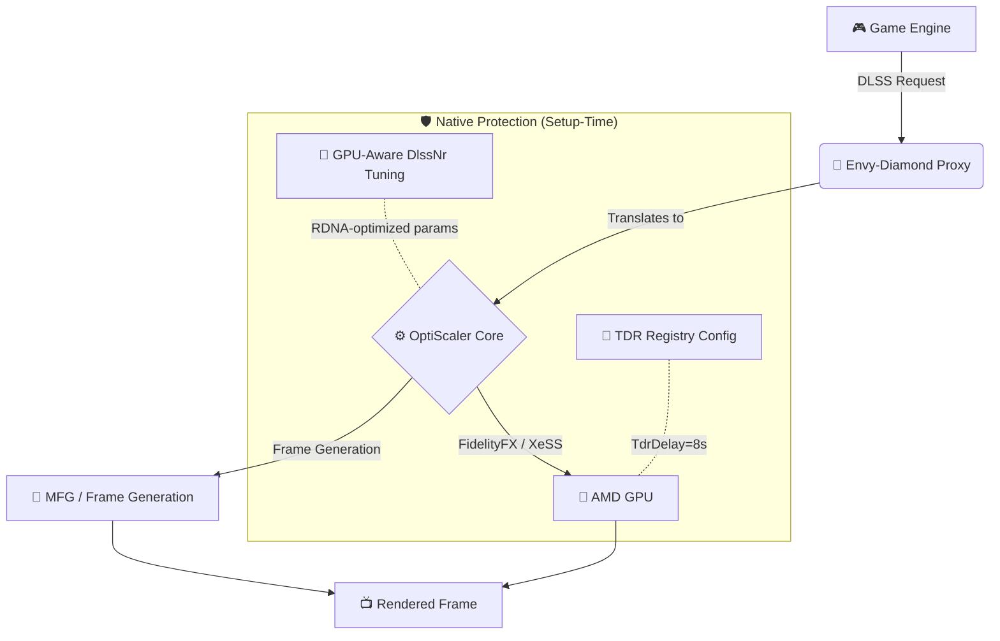

<div align="center">

# 💎 Envy-Diamond 💎

**Advanced Neural Rendering & Frame Generation Translation Layer for AMD GPUs**

[](https://github.com/mnector/Envy-Diamond/releases)
[]()
[]()
[](https://paypal.me/mnecstream)

Envy-Diamond unlocks the true power of DLSS and OptiScaler features on AMD hardware, injecting a custom proxy to translate calls and deliver massive framerate uplifts!

</div>

---

## 📋 Table of Contents
- [🛡️ AMD TDR Configuration](#️-amd-tdr-configuration)
- [⚠️ Disclaimer](#️-disclaimer)

---

## ✨ Features

* 🔴 **AMD Neural Rendering Support:** Experience high-end upscaling paths natively adapted for AMD architecture via HIP.
* 🛡️ **Native TDR Configuration:** Setup automatically configures Windows TDR registry (TdrDelay, TdrDdiDelay) to prevent AMD HIP compute kernel timeouts during neural rendering passes. No external daemons or wrappers needed.
* 🤖 **GPU-Aware Auto-Tune:** Detects your RDNA generation at install time and configures optimal DlssNr parameters (model scale, neural lighting strength, passes) to balance quality and stability.
* 🛠️ **Unreal Engine 5 Hardened:** Includes automatic resource barrier fixes (`ColorResourceBarrier=4`, `MotionVectorResourceBarrier=8`) to prevent memory access violations and colorful artifacting in UE games.
* ⚡ **Multipass Optimization:** Efficient HIP worker publication following actual D3D12 `ExecuteCommandLists`, reducing capture wait times drastically.
* 🎭 **Proxy Spoofing:** Automatic injection bypassing vendor locks.

---

## ⚙️ How it Works



---

## 📥 Installation

> [!WARNING]  
> **To comply with GitHub's file size limits and Terms of Service, proprietary binaries (.dll/.bin) are NOT included in the source code.** 

1. Go to the **[Releases](https://github.com/mnector/Envy-Diamond/releases)** tab and download the latest `Envy-Diamond-Release.zip`.
2. Extract the contents into an empty folder on your desktop.
3. Make sure your game is completely closed.
4. Run `Setup.bat` **as Administrator** (required for TDR registry configuration).
5. Browse for your game's executable (`.exe`).
6. Click **Install**. 

> [!TIP]
> **Spider-Man Remastered Players:** Add `-forceReflexMarkers` to your Steam launch options to enable the Streamline path without breaking ray-tracing!

> [!IMPORTANT]
> **Restart your PC after the first install.** The TDR registry changes take full effect after a reboot.

---

## 🛡️ AMD TDR Configuration

Envy-Diamond v2 natively prevents AMD HIP timeout crashes by configuring the Windows TDR (Timeout Detection and Recovery) registry at install time.

### The Problem

AMD HIP neural-rendering kernels execute as generic GPU compute. Windows' default `TdrDelay` of **2 seconds** is too short for heavy inference passes that compete with game rendering, upscaling, and frame generation for GPU time. When a kernel exceeds this limit, Windows kills it:

```
AMD timeout: current input preserved; retry in 1s with fresh history. Events=3
```

### The Fix

Setup automatically configures:

| Registry Key | Default | Envy-Diamond | Purpose |
|---|---|---|---|
| `TdrDelay` | 2s | **8s** | Time before GPU is considered hung |
| `TdrDdiDelay` | 5s | **10s** | DDI callback timeout |
| `TdrLimitCount` | 5 | **10** | Tolerated TDRs before system crash |
| `TdrLimitTime` | 60s | **120s** | Observation window for TDR count |

Previous values are backed up to `tdr_backup.json` in your game's backup folder for safe restoration.

### GPU-Aware Neural Rendering Profiles

| RDNA Gen | Neural Rendering | Model Scale | Lighting | Notes |
|---|---|---|---|---|
| RDNA 4 | ✅ Full | 1 | 0.5 | Native target platform |
| RDNA 3 | ✅ Light | 1 | 0.3 | Reduced lighting to avoid contention |
| RDNA 2 | ❌ Off | 0 | — | Insufficient compute for NR |

---

## ⚠️ Disclaimer

> [!CAUTION]
> This project modifies game binaries in memory and bypasses vendor checks. **Use at your own risk in single-player games only.** Do not use in multiplayer games with anti-cheat software, as it will likely result in an account ban.

---
<div align="center">

*If this mod saved your framerate, consider buying me a coffee to support future development!*

<a href="https://paypal.me/mnecstream" target="_blank"></a>

</div>
